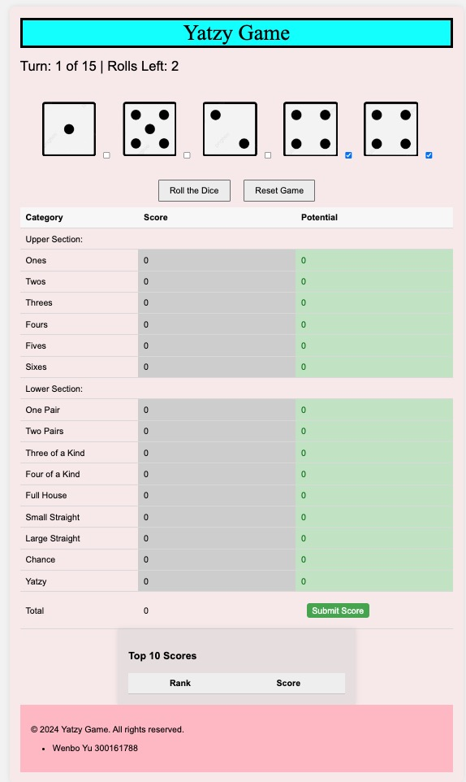

# CSI3140_A3 Yatzy game(PHP)
### Group25
* Wenbo Yu 300161788

## Introduction
This repository documents the design system for my Yatzy game website. This game is a single-player Yatzy game completely in PHP & HTML/JS/CSS. The game will enforce the rules of Yatzy, will manage the game state (current score, current role, etc) and will notify the user of the final score when the game is done.
Students enhanced their Yatzy game to have a PHP server component for managing the scoring by using AJAX to communicate between the HTML/CSS/JS client with the PHP server.

## Usage
1. Put folder: v02_Assignment3 into IDE Phpstorm project, and run v02_Assignment3/public/yatzy.html to play the game.
   
2. Using PHP's Built-in Server
PHP comes with a simple built-in server that is very suitable for development and testing purposes. You can use this server on your local computer to run your game.

Steps:

Open your command line tool:

On Windows, open Command Prompt or PowerShell.

On macOS or Linux, open Terminal.

---Command: cd path to folder(v02_Assignment3)---

Start the PHP built-in server:

---Command: php -S localhost:8000---

  
This command will start a web server on your local machine on port 8000. You can use any available port.

Access in your browser:
Open a browser and enter http://localhost:8000/public/yatzy.html to start the game.

## Screenshots

## How to Play? >------------------------------------------------------------------------

Press the "Roll the Dice" button to roll the dices.

Use checkboxs to choose dice value keep or not.

The row of Potential will show potential score once Rolls Left is 0.

Press the row of Potential to choose which potential score want to be added in Score and Total Score.

Once 15 turns is over press green button "Submit Score" to submit total score into Top10 leaderboard.

Use "Reset Game" button to begin a new game.
